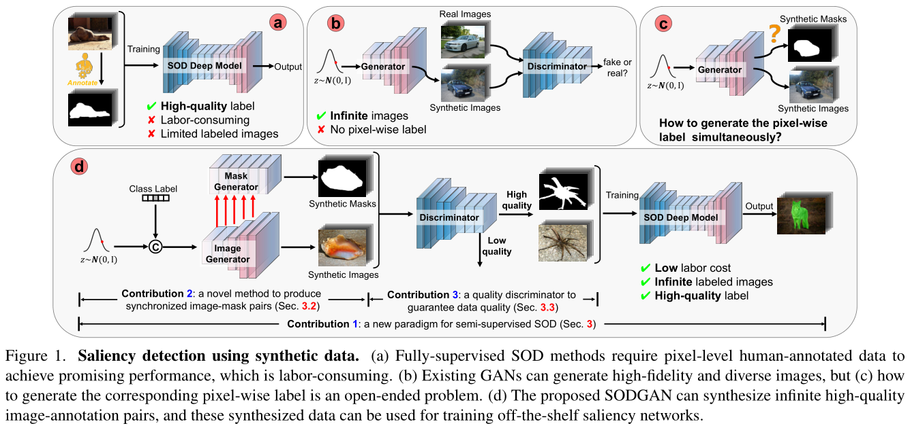
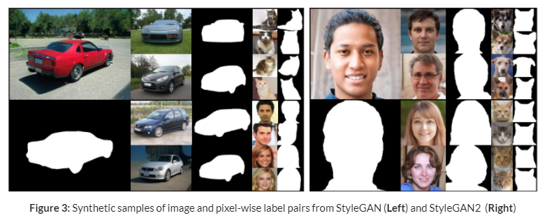
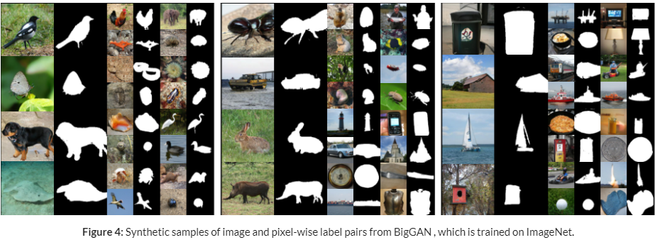
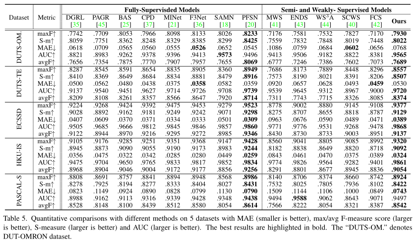

# SODGAN

This is the official code and data release for:

## [Semi-Supervised Salient Object Detection via Synthetic Data](https://sites.google.com/view/sodgan/)




## Requirements

- Python 3.8  is supported.
- Pytorch 1.8.1.
- This code is tested with CUDA 10.2 toolkit and CuDNN 7.5.

## Training 

To reproduce paper **Semi-Supervised Salient Object Detection via Synthetic Data **: 

```
cd SODGAN
```

1. Run **Step1: training mask generator**.  
2. Run **Step2: synthesizing annotation-image pairs**.
3. Run **Step3: Train SOD model**.


#### 1. Training Mask Generator

we take training stlyegan as an example:

a. Download pretrained model from StyleGAN [https://github.com/NVlabs/stylegan]. Put pretrained model in  'your/path/' and you have revised the path of 'stylegan_checkpoint' of ./experiments/cat_sod.json 

b. Download Dataset from [https://pan.baidu.com/s/1e7SRXVTqTxR3CQJEtq_HFg] (fetch code:2nab ). Unzip stylegan datasets into './data/'.You have to revise 'annotation_mask_path', 'testing_path', 'average_latent' of ./experiments/cat_sod.json 


```
c. python train_stylegan_G_mask.py --exp experiments/stylegan/cat_sod.json  --test False
```


#### 2. Synthesizing annotation-image pairs  
```
python train_stylegan_G_mask.py --exp experiments/stylegan/cat_sod.json  --test True  --resume [your trained model path] 
```
Example of sampling images and annotation:



or
```
python train_biggan_G_mask.py --exp experiments/biggan/all.json  --test True  --resume [your trained model path] 
```
Example of sampling images and annotation:



#### 3. Train SOD model

These synthesized data can be used for training off-the-shelf saliency networks.


## Pretrained Model

You can skip the step 1 and use our pretrained model as below: \

Mask Generator (BigGAN) [https://pan.baidu.com/s/1Nr1OfQq7d_6hakDo8z218A] (fetch code:lb6u ) \
Mask Generator (StyleGAN cat) [https://pan.baidu.com/s/1_yhbGVzH92BEU8P66RtLwg] (fetch code: pkw8 )

## Saliency maps

We also provide saliency maps for comparisons [https://pan.baidu.com/s/1WN613RbPeSzmZiISMymt_Q] (fetch code:b818 )


##Comparison with state-of-the-art



## License

For any code dependency related to StyleGAN, StyleGAN2, and BigGAN, the license is under the [Creative Commons BY-NC 4.0](https://creativecommons.org/licenses/by-nc/4.0/) license by NVIDIA Corporation.  To view a copy of this license, visit [LICENSE](https://github.com/NVlabs/stylegan/blob/master/LICENSE.txt ).
